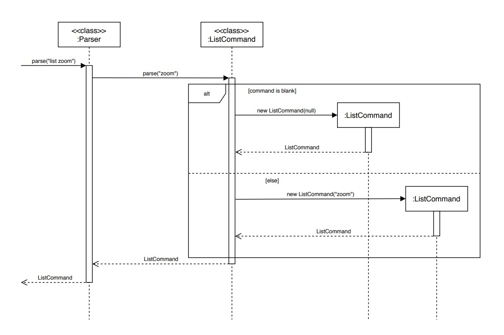
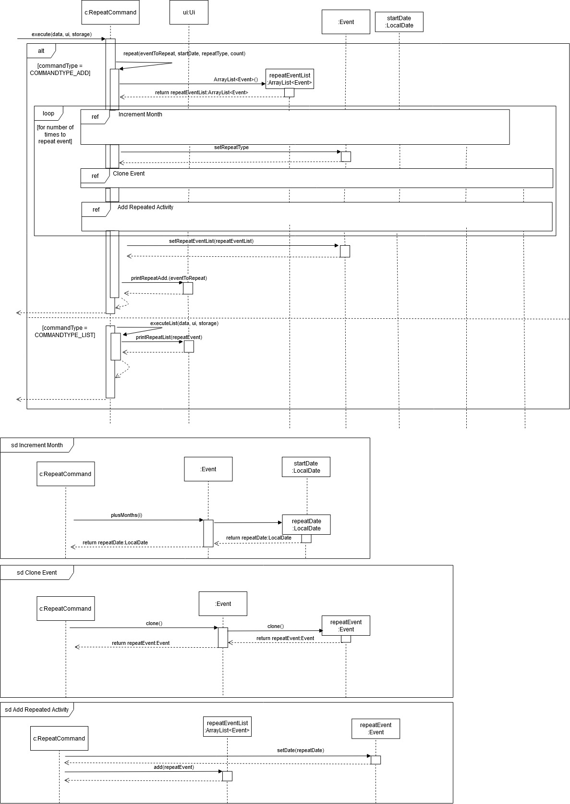
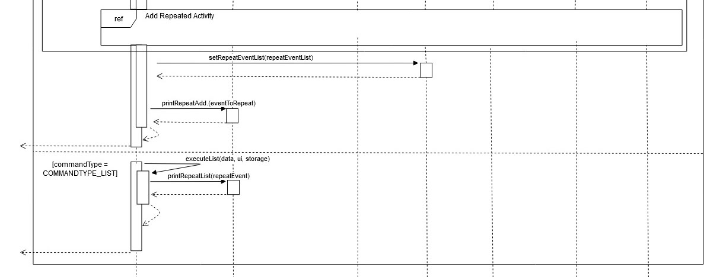

# Developer Guide

{Table of contents goes here}

## Setting up, getting started

## Design
#### Command Component


API: [Command.java](https://github.com/AY2021S1-CS2113T-T12-4/tp/blob/master/src/main/java/seedu/duke/command/Command.java) 
1. `Parser` class to parse the user command 
1.  This results in a `Command` object executed by the `Parser`
1.  The command execution can affect the `Model`


### Architecture


The ***Architecture Diagram*** given above explains the high-level design of App. Given below is a quick overview of
each component.

`Duke` class contains the main method. It is responsible for,

- At app launch: Initializes the components in the correct sequence, and connects them up with each other.  
- At shut down: Stores the user data from memory into the hard disk.

The rest of the App consists of five components.

- `Ui`: The Ui of the App.
- `Parser`: Parses the input to determine which command to execute.
- `Command`: The command executer.
- `UserData`: Holds the data of the App in the memory.
- `Storage`: Reads data from, and writes data to, the hard disk.


## Implementation

{Describe the design and implementation of the product. Use UML diagrams and short code snippets where applicable.}.

### Check feature

#### Implementation

The check feature is implemented using the `CheckCommand` class. `CheckCommand` accesses the `Event`s stored within `EventList`s in order to determine if events are occurring within a given time period. It implements the following operations:

- `CheckCommand#getDate(stringDate)` -- Parses a given string to get a LocalDate variable (either the start or end date for the time period).
- `CheckCommand#getTime(stringTime)` -- Parses a given string to get a LocalTime variable (either the start or end time for the time period).
- `CheckCommand#checkEventsInTimeRange(eventsList, startDate, endDate, startTime, endTime)` -- Checks each event in the eventsList to see if they occur within the time period defined in the command, and saves all coinciding events in an ArrayList.

These operations are not exposed, and are used as private methods within the `CheckCommand` interface.

Given below is an example usage scenario and how the check feature functions.

Step 1. The user inputs `check 11/5/2020; 5:15 PM; 15/5/2020; 9 PM` in order to check for events occurring between 11th May 2020, 5:15 pm and 15th May 2020, 9:00 pm. This input is received by the Ui, which processes it into a string. The string is parsed by the Parser, which returns a CheckCommand with the date and time parameters stored in it as a string.

Step 2. `CheckCommand#execute()` is called. The command string containing the date and time parameters are split into a String array to separate the different parameters. 

Step 3. Within `CheckCommand#execute()`, `CheckCommand#getDate()` is called to parse the start and end dates, and `CheckCommand#getTime()` is called to parse the start and end times.

This sequence diagram shows how the `getDate` method functions:


Step 4. Within `CheckCommand#execute()`, the start date time and end date time is passed to `CheckCommand#checkEventsInTimeRange()` along with an `EventList` (i.e. Zoom, Personal or Timetable). This method checks each `Event` in the `EventList` to determine if the event occurs within the time period. If the event date time coincides with the time period, the event is added to an ArrayList that stores all the coinciding events in the current `EventList`. This is done for each `EventList`. 

Step 5. The contents of the ArrayLists returned by `CheckCommand#checkEventsInTimeRange()` are combined into a single ArrayList, and a new `EventList` ("coinciding") is created using this combined list of events.

Step 6. `Ui#printList()` is called to print the list of coinciding events.

The following sequence diagram shows how the check operation works:


#### [Proposed] Deadline feature

The user executes ```deadline 1; 7/10/20; 11:20 PM``` command to set the deadline for the 1st event in Personal event list
to be on the 7th October 2020 at 11:20 PM. 
The ```deadline``` command calls ```DeadlineCommand#execute()```, adding/updating the personal event deadline. <br>
Given below is how the deadline command behave: <br>

<p align="center">
  
</p>

The following sequence diagram shows how the deadline operation works: <br>


#### [Proposed] Goal feature

##### Proposed Implementation

The proposed goal feature is achieved by `GoalCommand`. It either prints the current goal stored internally in
`UserData` if there is one, or it sets the input as the new goal by replacing the previous goal.

Given below is an example usage scenario of the goal feature.

Step 1. The user launches the application for the first time. `Ui#printGoal` is called, 
a line informing them they have no goal is printed.

Step 2. The user executes `goal save money` command to set the goal as "save money".
The `goal` command is passed through a parser to return the GoalCommand with arguments initialised.

Step 3. `GoalCommand#execute()` is called, setting the goal in `UserData` to "save money". The change is printed
with `Ui#printChangeGoal()`.

Step 4. The user executes `goal` command to print the current goal.
The `goal` command is passed through a parser to return the GoalCommand with blank arguments.

Step 5.  `GoalCommand#execute()` is called, to retrieve the current goal in `UserData` and print it
with `Ui#printGoal()`.

The following sequence diagram shows how the `goal save money` command is parsed:


The following sequence diagram shows how `GoalCommand#execute()` works:


#### Add Feature

The add feature in the program allows the user to create one of 3 different events in scheduler--;.
These 3 are the Personal, Zoom and Timetable events. These events have varying numbers of arguments or fields that can 
be inserted upon creation. 

Firstly, to begin, the user needs to key in the command `add [event type] [description]; [date]; [time]`
The optional fields to fill in like the link and location for the zoom and timetable classes can be inserted respectively . For example,
`add zoom cs2113t meeting; zoom.sg; 16/09/20; 2100`

When a command like this is called, the constructor to `addCommand` will be able to detect the event type based on the user's input. It then stores the event type in that instance of the addCommand.

Next, when `addCommand#execute` is called from the main, this method will call the respective method to create one of the three events. These methods are `addCommand#addPersonal`, `addCommand#addZoom`, and `addCommand#addTimetable`.

The personal event can contain the following fields: 
1. Description
2. Description and date
3. Description, date and time

The zoom event can contain the following fields:
1. Description and link
2. Description, link, date and time

The Timetable event can contain the following fields:
1. Description, date and time
2. Description, location, date and time

The fields for what each event can contain were chosen based on what we as a team thought were important fields for the respective event types.
However, these methods can easily be edited to accept different numbers of fields if we change our minds in the future.

Given below is an example scenario of the add feature:
 
Step 1. The user launches the application for the first time. There will be no events stored at the moment.
 
Step 2. The user executes `add zoom cs2113t meeting; zoom.sg; 16/09/20; 2100`. The `addCommand` instance is created and detects that the event is of Zoom type.
 
Step 3. `addCommand#execute` is called. The class knows the current addCommand is of Zoom type so it calls `addCommand#addZoom`.
 
Step 4. `addCommand#addZoom` detects there are 4 fields in the command, separated by semicolons, and uses this to create a new Zoom event.
 
Step 5. The Zoom event is then added to the user's `UserData` for further use.
 
The following sequence diagram shows how the whole add feature works: <br>


#### List feature

The list feature allows the user to print a list of events added by type.
The list of events is print according to the order it was added in.

User calls the list command by executing `list [argument]`.

Executing `list` without specifying any argument prints a list of event types available.  
Specifying an event type as the argument prints a list of events of that type.  
Specifying `all` as the argument prints a list of all events in the order: Personal, Timetable, Zoom.

Given below is an example usage scenario of the list feature.

Step 1. The user executes `list zoom` command to print a list of Zoom events.
The `list` command is passed through a parser to return the ListCommand with arguments initialised.

Step 2. `ListCommand#execute()` is called, retrieving the list of Zoom events in `UserData`.

Step 3. `ListCommand#execute()` calls `Ui#printList()` and passes the list of Zoom events to print.

Step 4. `Ui#printList()` loops through every event in the Zoom event arraylist and prints it.

The following sequence diagram shows how the `list zoom` command is parsed:



#### Repeat Feature

The repeat feature on the program allows for the user to be able to make certain events repeat several times over a defined time period.
For instance, the user can request for a personal event to be repeated monthly for four months. To run the program, the user will need to key in the command `repeat [event type] [index] [timeUnit] [count]`

|Argument| Description |
|--------|----------|
|event type|What type of event is to be repeated? Accepted arguments are `personal`, `timetable` or `zoom`|
|index|Index number of the event to be repeated that is stored on the Event List|
|timeUnit|For what unit of time each event is to be repeated. Accepted arguments are `daily`, `weekly` and `monthly`|
|count|Integer indicating how many times the event is to be repeated|

For example, to repeat a personal event located at index 2 for 3 days, the user will key in this: `repeat personal 2 daily 3`.

The following sequence diagram shows the overall process of repeating an event:



The steps to repeating the command will be described in the following sections. 

##### Step 1: Obtaining the event information

The repeat command first locates the event that is to be repeated along with its starting date.
Next, it creates an empty ArrayList called `repeatEventList` that will contain all repeated events.


##### Step 2: Incrementing the Original Date

The repeatCommand object will now call upon Event to increment the date by a fixed unit of time. In the following diagram, it shows how the program flow will work should a monthly repeat increment be set. 
The increment date will be assigned the name `repeatDate`


##### Step 3: Set Repeat type

The repeatCommand now will set the original Event to have a repeat type setting. In the diagram's example, it will be set to `monthly`


##### Step 4: Clone the event

The original event is now cloned as shown in the following sequence diagram.


##### Step 5: Add the cloned activity

The cloned activity will now have its date set to be `repeatDate`. This new activity is now added into the `repeatEventList` as shwon in the following diagram.


##### Step 6: Repeat steps 2 to 5

Steps 2 to 5 are repeated up till the number specified by `count` as shown in the loop.


##### Step 7: Assign the ArrayList as the RepeatEventList attribute of the original event.

Finally, set the `repeatEventList` using the `setRepeatEventList` command as shown in the following section of the sequence diagram. The results of this process is printed and control returns back to the main program.


 
 
## Documentation, logging, testing, configuration, dev-ops (not sure what this entails)

## Appendix: Requirements

### Product scope

##### Target user profile

<ul>
    <li>has a need to organise events using scheduler</li>
    <li>prefer desktop application</li>
    <li>can type fast</li>
    <li>prefer typing to mouse interactions</li>
    <li>is reasonably comfortable using CLI apps</li>
</ul>

##### Value proposition

{Describe the value proposition: what problem does it solve?}

### User Stories

|Version| As a ... | I want to ... | So that I can ...|
|--------|----------|---------------|------------------|
|v1.0|office worker (working from home)|organise large amount of online Zoom meetings to manage|keep track of his schedule for the day|
|v1.0|university student|consolidate my schedule for both my online zoom lectures and my ordinary timetable|better manage my time|
|v1.0|university student having projects|be informed of the goals of my project|keep track of the project details|
|v1.0|university student|customise repeated task|set events like tutorials to weekly|
|v1.0|teacher|organise all my zoom links for my classes|it can be easily accessible.|
|v1.0|user|see the events that I have created|refer to them when I forget|
|v1.0|user|check when I am available on that day|avoid manually searching through my entire calendar to find out if I have time|
|v2.0|user|be able to keep track the status of completion of the events I created|focus more on the tasks that I need to complete|
|v2.0|user|view which events are upcoming in a convenient readable format|locate the events easily by date|
|v2.0|user|the application to alert me when my deadlines are coming up|be given enough time to work on them and not rush last minute|
|v2.0|user|create deadlines from the email text body|avoid looking through the email to create one by one|
|v2.0|new user (new to text-based application)|detailed directions on commands I can use|easily navigate through the application|
|v2.0|new user (expert in using text-based application)|have some useful shortcut keys|speed up common tasks|

### Use Cases

### Non-Functional Requirements

<ol>
    <li>Work on any mainstream OS that has Java 11 or above installed</li>
    <li>A user who has faster typing speed than average should be able to use this program with ease</li>
</ol>

## Glossary

* *glossary item* - Definition

## Instructions for manual testing

{Give instructions on how to do a manual product testing e.g., how to load sample data to be used for testing}
